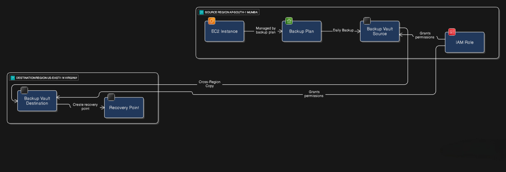
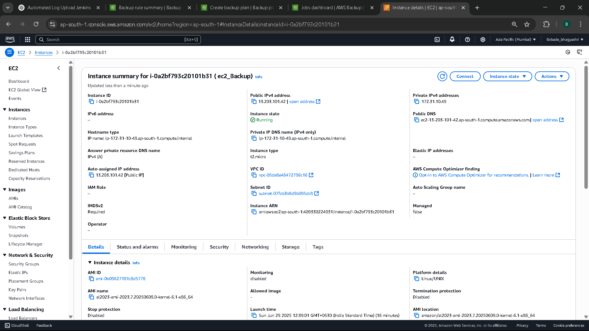
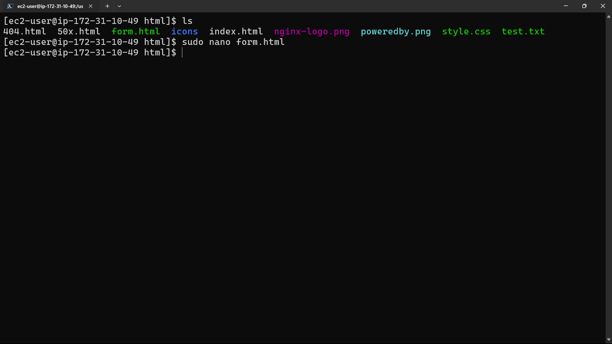
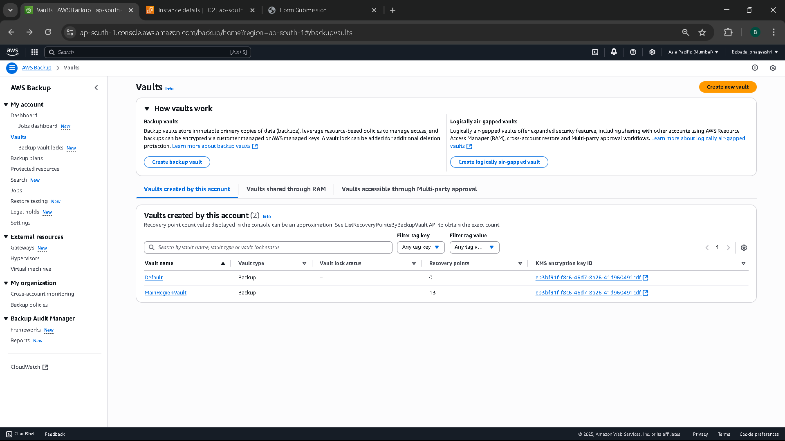
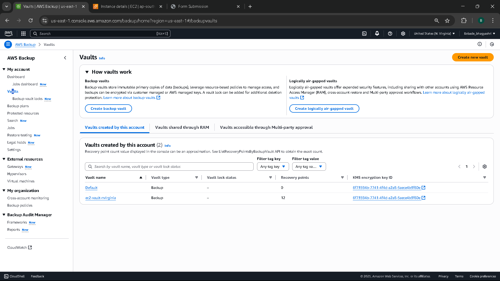
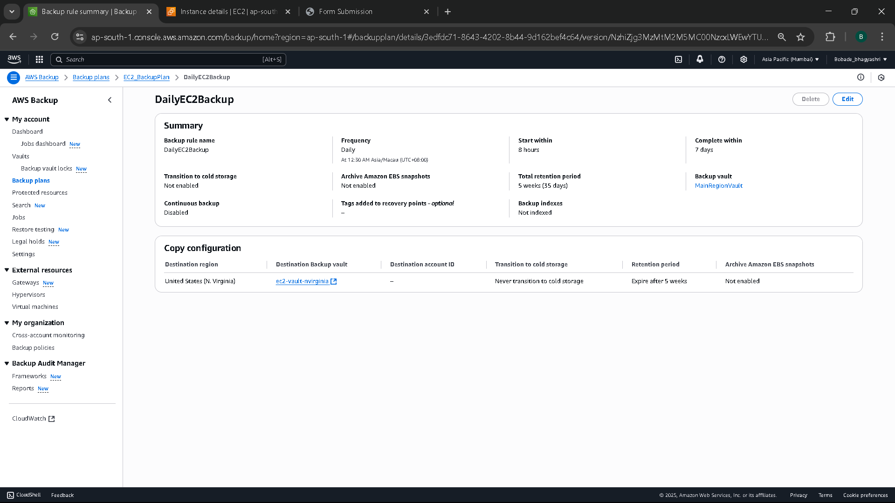
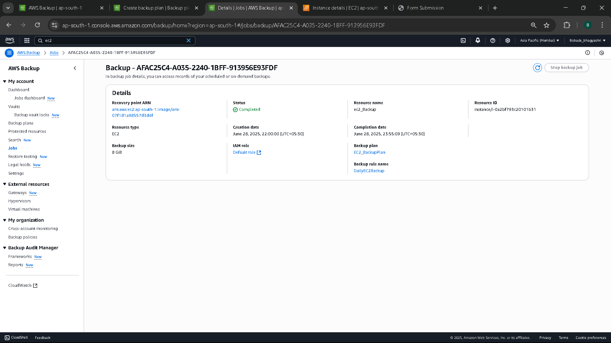
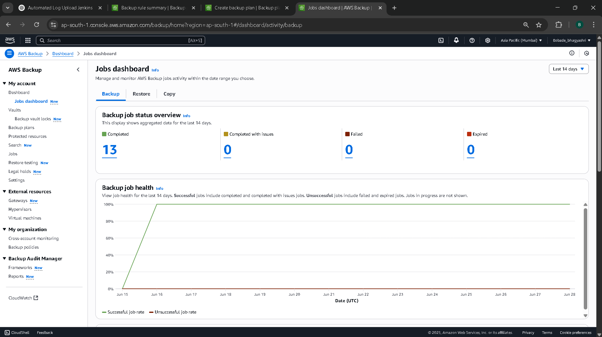
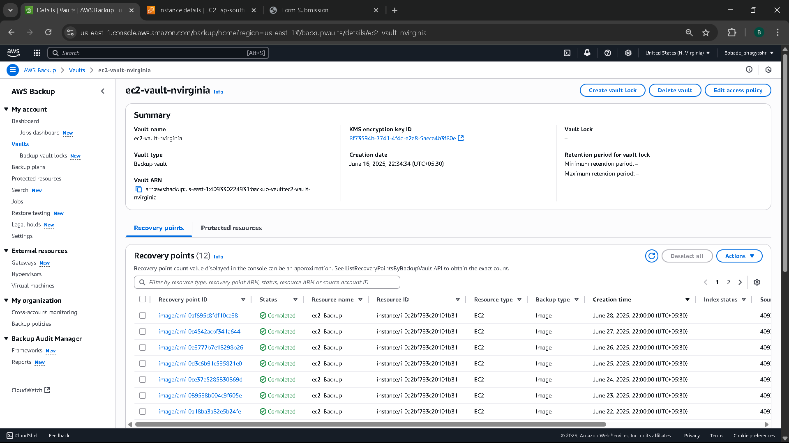

# 🚀 Enable Cross-Region Backup Replication for EC2 using AWS Backup

## 🎯 Objective
This project demonstrates how to automatically back up an EC2 instance using AWS Backup and replicate those backups to another AWS region for enhanced durability and disaster recovery.

---

## 📦 Requirements

To implement this project, you need the following:

### 🔧 AWS Services
- Amazon EC2
- AWS Backup
- AWS IAM (for backup and restore permissions)

### ✅ IAM Permissions
Ensure your IAM role or user has the following permissions:
- `ec2:DescribeInstances`
- `backup:CreateBackupPlan`
- `backup:StartBackupJob`
- `backup:CreateBackupVault`
- `backup:CopyFromBackupVault`
- `backup:CopyToBackupVault`
- `iam:PassRole`

### 🌍 Regions
- Source Region: `ap-south-1` (Mumbai) or your selected region
- Destination Region: e.g., `us-east-1` (N. Virginia) or any other

### 💻 Tools
- AWS Management Console (or AWS CLI)
- Internet connection to access the AWS Console

---

## 🛠️ Project Workflow

### 1. EC2 Instance Setup
- Launched an EC2 instance in the **primary AWS region**.
- Uploaded sample files to test data integrity during backup and recovery.

---

### 2. AWS Backup Vaults
Created two backup vaults:
- One in the **source region** for initial backup storage.
- One in the **destination region** for cross-region replication.

#### 🔹 Source Vault:

#### 🔹 Destination Vault:

---

### 3. AWS Backup Plan Creation
- Created a backup plan with daily backup frequency.
- Assigned the EC2 instance as a resource.
- Enabled lifecycle rules to transition backups to cold storage after 30 days.

---

### 4. Cross-Region Backup Replication
- Configured the backup plan to replicate backups to another AWS region.
- Selected a destination vault and defined the copy frequency and retention.
  

---

### 5. Backup Jobs Validation
- Triggered an on-demand backup for immediate testing.
- Verified job completion status in the **Backup Jobs** section.

---

### 6. Cross-Region Recovery Point
- Switched to the **destination region**.
- Verified that the replicated recovery point was created in the vault.

---

## 🔍 Why AWS Backup?

AWS Backup is a fully managed backup service that:
- Automates and centralizes backup across AWS services.
- Supports compliance, auditing, and retention policies.
- Enables **cross-region replication** to protect from regional failures.
- Ensures secure and reliable **disaster recovery** strategies.

With AWS Backup, you get **policy-driven backups**, **fine-grained control**, and **cost-effective cold storage transition** options — all within the AWS ecosystem.

---

## 📄 Summary Report

A detailed PDF summary report is included in this repository:  
👉 [Summary_Report.pdf](./Summary_Report.pdf)

---

## ✅ Conclusion

This project showcases how a well-structured AWS Backup plan, combined with cross-region replication, can help build **resilient and disaster-ready cloud infrastructure**.

If you found this helpful or have questions, feel free to connect with me on [LinkedIn](https://www.linkedin.com/in/bhagyashribobade/) or check out more projects in my GitHub profile.

---

### 📌 Tags
`AWS` `EC2` `AWS Backup` `Cross-Region Replication` `Disaster Recovery` `DevOps` `Cloud Projects`

---
